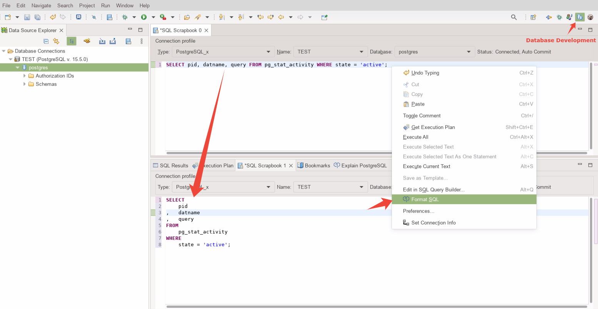
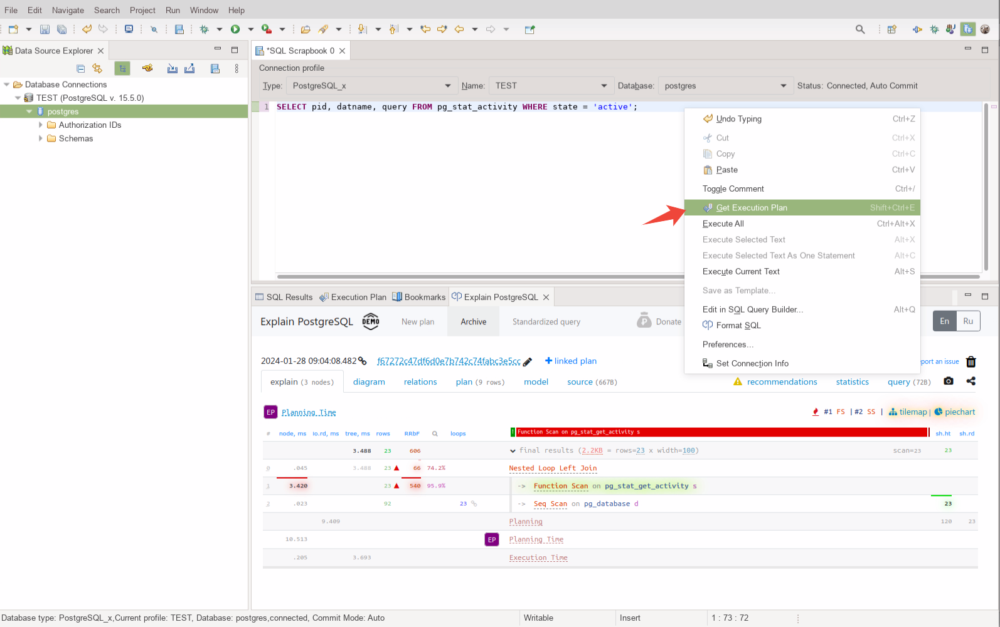
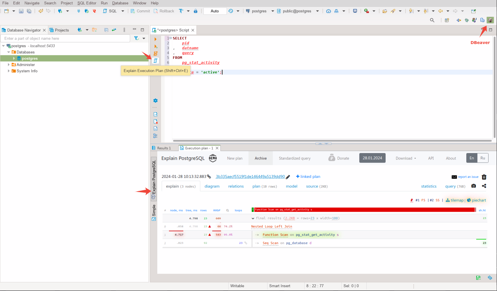
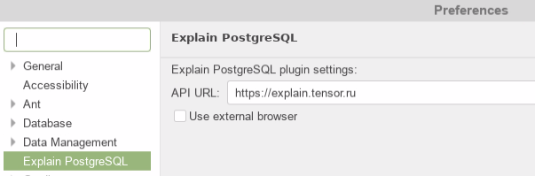

# Explain PostgreSQL plugin for Eclipse and Dbeaver

Analyzes EXPLAIN plan from PostgreSQL and related (Greenplum, Citus, TimescaleDB and Amazon RedShift).
  
Shows plan and node details and visualizations with piechart, flowchart and tilemap, also gives smart recommendations to improve query.

Uses the public api from the <a href="https://explain.tensor.ru">explain.tensor.ru</a> , the site can be changed in Preferences.

Uses the <a href="https://marketplace.eclipse.org/content/chromium-integration-eclipse">Chromium Integration for Eclipse</a> to open the site.

<a href="https://explain.tensor.ru/about">Learn more</a>
  
<h3>Usage:</h3>
<ul>
    <li>Database Development:</li>
    <ul>
        <li>Format query - select "Format SQL" from the context menu of the SQL editor
        </li>
        
        <li>Explain plan - select "Get Execution Plan" from the context menu of the SQL editor
        </li>
        
    </ul>
    <li>DBeaver</li>
    <ul>
        <li>Format query - select "Format SQL" from the context menu of the SQL editor
        </li>
        
        <li>Explain plan - select "Execute | Explain Execution Plan" from the context menu.
        </li>
        
    </ul>
    <li>Preferences</li>
    <ul>
        <li>
        Select "Explain PostgreSQL" from Eclipse's Preferences.
        </li>
        
    </ul>
</ul>
 
<h3>Install</h3>
From the Eclipse menu, choose Help -> Install new software and enter the URL:
 <code>https://explain.tensor.ru/downloads/plugins/eclipse/</code>
 

<a href="https://n.sbis.ru/explain">Support</a>
